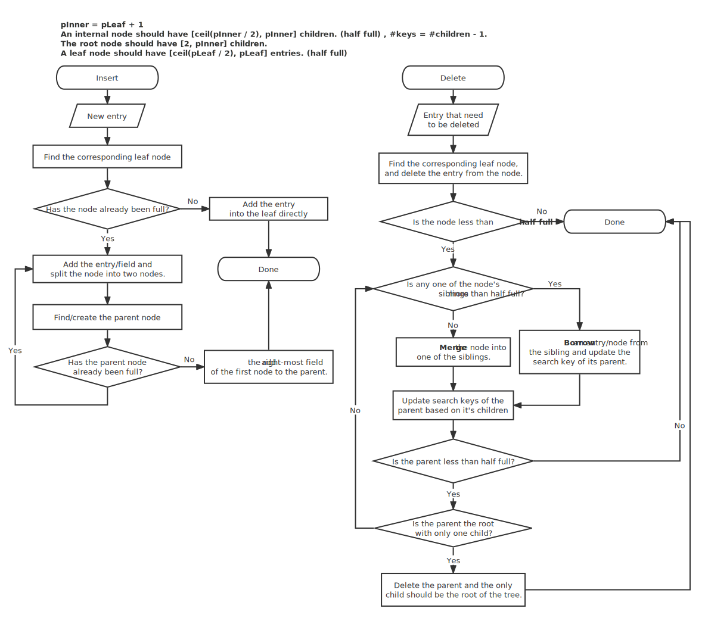

## Tiny DB
### Lab 1: Storage Structure
- Tuples: the basic building block of a table (row).
- TupleDesc: specifies a schema for a tuple (types and names of fields).
- Catalog: keeps track of what tables are currently in the database and provides a way to access them.
- HeapFiles: the physical representation of the data in our database (table). A HeapFile consists of many HeapPages.
- HeapPage: Manages the various tuples. A HeapPage consists of a header (bitmap) + some slots (tuples).
   - Each slot is assigned one bit in the header. 1: that slot is occupied; 0: that slot is empty and can have new data written to it.
   - #tuples_per_page = floor(8 * page_size / (8 * tuple_size + 1)).
   - #header_bytes = ceil(tuples_per_page / 8)

+ Adding a tuple: Find a page with an empty slot, or create a new empty heap page and pass the new tuple to it, then write the page to the disk (.dat file).
+ Deleting a tuple: get the page id and tuple id, then set the bit in the header to 0 (logical deletion).

### Lab 2: Relational Operations
- Relation
  - Select operation (WHERE clause): Returns a new relation containing selected tuples based on a condition.
  - Rename: Returns a new relation with updated field names.
  - Project (SELECT clause): Returns a new relation with certain columns, discards the rest.
  - Join (Cartesian Product combined with a select operation): Returns a new relation containing all of the fields from both of the given relations and selected tuples based on a condition. (Nested Loop Join)
  - Aggregate (Simplified)
    - MAX, MIN, AVG, COUNT, SUM.
    - with GROUP BY: assume that the new relation will have two columns: a column containing the group and a column containing the data to be aggregated.
    - without GROUP BY: assume that the new relation will have the only column that is being aggregated.
- Query
  - Use an open-source SQL parser: JSQLParser.
  - `SELECT * FROM leftTable JOIN rightTable ON leftTable.leftCol=rightTable.rightCol JOIN ...`
    - FROM
      - JOINs (cascade joins)
    - `WHERE col \<op> operand`
    - `SELECT field1 AS userId, field2, field3 ... / SELECT * / Aggregations`

### Lab 3: Index (B+ Tree)

### Lab 4: BufferPool & Transactions
- BufferPool
  - Manage a cache of HeapPages. Any HeapPages that need to be read or written to will first be stored in this cache. If a page is modified, we will mark that page "dirty".
    - Implements an LRU cache. 
    - Don't evict dirty pages.
    - If a transaction has been committed, release all locks and write the modified pages to disk, then mark these pages "clean".
    - If a transaction has been aborted, then the BufferPool discards pages modified by this transaction.
  - Manage page-level strict two-phase locks (Locks should generally be kept until the transaction is complete).
    - Block if a transaction requests a write (exclusive) lock that is not currently available.
